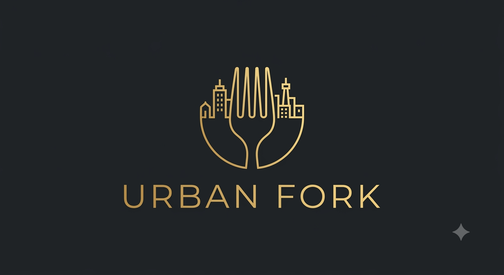

# ⚜️ Urban Fork — Luxury Cinematic Fine Dining

<p align="center">
  
</p>

<p align="center">
  <strong>Where Every Bite Becomes A Memory</strong>
</p>

<p align="center">
  An immersive, cinematic digital dining experience crafted for Manhattan's premier destination for exquisite cuisine, micro-interactions, and bespoke hospitality.
</p>

<p align="center">
  <a href="https://theurbanfork.com"><strong>Explore Experience</strong></a> •
  <a href="#-architecture"><strong>Architecture</strong></a> •
  <a href="#-features"><strong>Core Features</strong></a> •
  <a href="#%EF%B8%8F-development"><strong>Quick Start</strong></a>
</p>

---

## 🍽️ The Culinary Vision

Urban Fork is a luxury dining concept located in the heart of Manhattan. The digital experience is built with meticulous attention to detail, combining fluid, scroll-synchronized motion, fine typography, and high-fidelity assets to bring a Michelin-star concierge desk directly to the browser.

---

## 💎 Elite Tech Stack & Performance

The codebase is built on **Next.js 16 (App Router + Turbopack)** and optimized for flawless 60fps+ rendering, keyboard navigation, and structural discoverability:

- **Core Framework**: Next.js 16 (React 19)
- **Styling & Theme**: CSS Variables + TailwindCSS
- **Animation Orchestration**: GSAP (GreenSock) + `@gsap/react`
- **Fluid Scroll Engine**: Lenis Smooth Scroll
- **Declarative Motion**: Framer Motion (for micro-interactions & entry states)
- **Forms & Validation**: React Hook Form + Zod validation
- **Backend Integrations**: Formspree (contact desk pipeline) & OpenAI Stream Completion API (concierge AI agent)

---

## 🗺️ Architectural Source of Truth

To ensure ease of updates for restaurant owners and hosts, business logic and SEO configs are centralized into single-source files:

- **Central Restaurant Profile**: [`src/constants/restaurant.ts`](file:///C:/Users/user/.gemini/antigravity/scratch/urban-fork/src/constants/restaurant.ts)
  - Address details, raw coordinates (Empire State Building proximity), WhatsApp links, social paths, and local operating hours.
- **Unified SEO & Structured Data**: [`src/constants/seo.ts`](file:///C:/Users/user/.gemini/antigravity/scratch/urban-fork/src/constants/seo.ts)
  - Meta tags, canonical links, keywords, and Schema.org JSON-LD restaurant configuration.
- **Sommelier & Chef Knowledge Base**: [`src/lib/conciergeKnowledge.ts`](file:///C:/Users/user/.gemini/antigravity/scratch/urban-fork/src/lib/conciergeKnowledge.ts)
  - Feeds the AI concierge context on tasting menus, wine lists, dress codes, and reservation rules.

---

## ✨ Immersive Experiences

### 1. Urban Concierge AI
- An elite virtual host powered by OpenAI streams. Offers tailored menu descriptions, wine pairings, and booking details with an conversational tone matching a Michelin-star Maître D'. 
- Utilizes `sessionStorage` history recovery and Lenis scroll prevention logic.

### 2. Luxury Contact Desk
- Split grid layout featuring a grayscale-filtered embedded map and an interactive contact desk.
- Submits form values directly to Formspree, verifying fields on error boundaries and displaying a custom glassmorphism modal with backup WhatsApp routing upon connection failure.

### 3. Interactive Culinary Menu
- Features high-resolution video reels of signatures (Hokkaido scallops, smoked duck confit, sage old fashioneds) with automatic off-screen playback pausing to optimize GPU decoding resources.
- Drawer panels containing sommelier insights slide in without triggering layout reflows.

### 4. Editorial Masonry Gallery
- A responsive, 4-column masonry gallery with clean image reveal masks, keyboard navigation, drag swipe lightbox events, and zero layout shifts.

### 5. Ambient Micro-Interactions
- Magnetically attracted buttons, custom spring cursor tracking, and floating ambient dust particles powered by GPU layer transforms (`will-change`).

---

## 🛠️ Development & Deployment

### Local Development
Clone the repository, install packages, and spin up the Turbopack server:

```bash
# Install dependencies
npm install

# Run the development server
npm run dev
```

Open **`http://localhost:3000`** in your browser.

### Production Build
Compile a production bundle and run the static page generation suite:

```bash
# Verify type checks and compile optimized pages
npm run build

# Boot local production build
npm run start
```

---

## 🤝 Project State & Tracking

- **Current Repository**: `https://github.com/pratyush-max/urban-fork`
- **Primary Branch**: `main`
- **Initial Deployment Commit**: `Urban Fork — complete build, ready for deployment`
